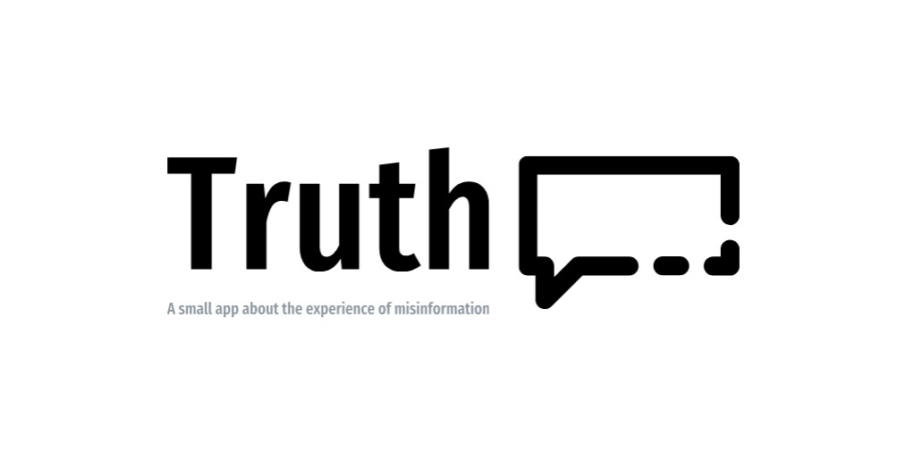

<h1 align="center">Truth</h1>
</img>
<h6 align="center">A small app about the experience of misinformation</h6>

## How to paly this game
1. 上傳新聞片段或者是利用預設的例子
2. 觀看新聞片段以及隨機一個人的句子然後把平板傳給下個人，接著
3. 全部人寫完後將平板傳回去接著會隨機分配讓你根據正確性評分
4. 產生結果（曲線圖）

# TODO
* 改善 result
    加上原始資料、參與人數、得到滿分的人
    標記看到原始資料的人
* 把灰框拿掉